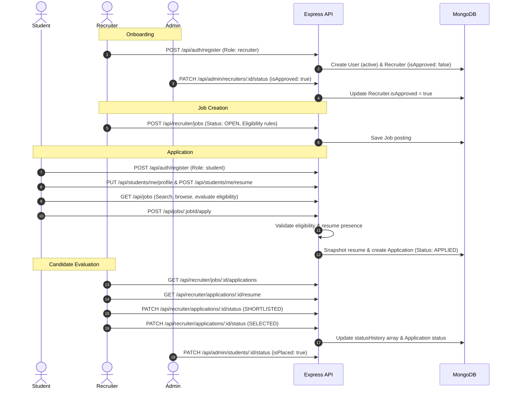
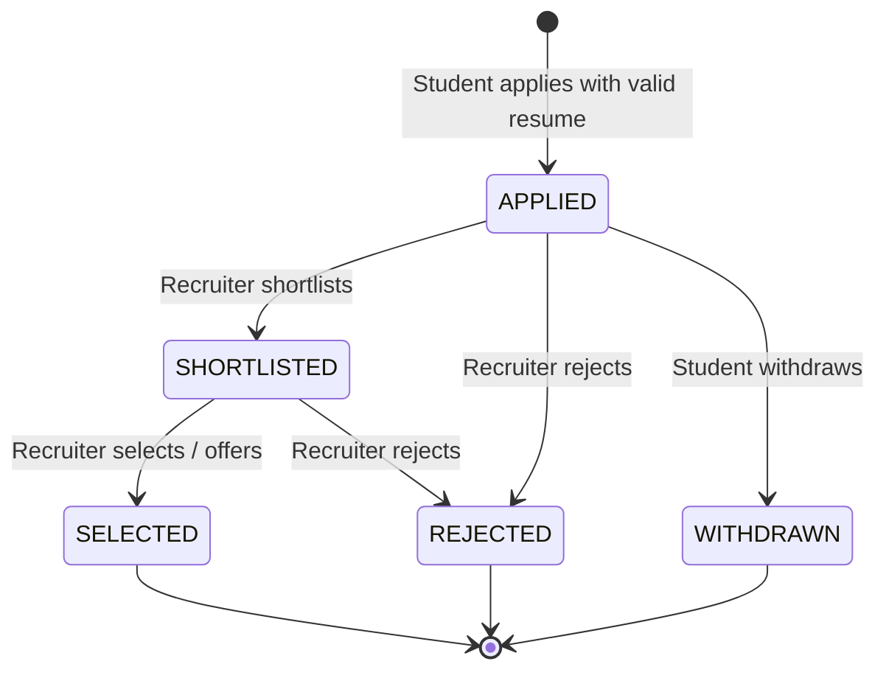

# PlaceForge

PlaceForge is a centralized campus recruitment and placement management platform built on the MERN stack (MongoDB, Express, React, Node.js). It provides structured workflows for students, corporate recruiters, and placement coordinators (administrators) to manage academic career profiles, job listings, eligibility validation, resume storage, application lifecycles, and audit logging under server-enforced Role-Based Access Control (RBAC).

---

## Table of Contents

- [Problem & Solution](#problem--solution)
- [User Roles & Access Matrix](#user-roles--access-matrix)
- [System Architecture](#system-architecture)
- [Core Workflows](#core-workflows)
- [Key Subsystems](#key-subsystems)
  - [Authentication & Role-Based Access Control](#authentication--role-based-access-control)
  - [Job Posting & Search](#job-posting--search)
  - [Eligibility Engine](#eligibility-engine)
  - [Application Lifecycle & State Machine](#application-lifecycle--state-machine)
  - [Resume Management & File Security](#resume-management--file-security)
  - [Admin Oversight & Audit Logging](#admin-oversight--audit-logging)
- [API Overview](#api-overview)
- [Configuration](#configuration)
- [Getting Started](#getting-started)
- [Testing](#testing)
- [Project Structure](#project-structure)
- [Security Implementation](#security-implementation)
- [Known Limitations & Operational Considerations](#known-limitations--operational-considerations)

---

## Problem & Solution

Campus recruitment often relies on disparate tools—such as spreadsheets, manual email chains, and chat groups—which creates operational challenges:

- **Untracked Applications**: Lack of a centralized database causes duplicate submissions, unrecorded withdrawals, and untraceable candidate progression.
- **Manual Eligibility Checking**: Coordinators and recruiters must manually verify GPA, backlogs, and branch requirements against changing candidate rosters.
- **Insecure File Handling**: Resumes shared over email or static links are exposed to unauthorized access, file spoofing, and broken references when candidates modify profiles post-submission.
- **Missing Administrative Auditability**: Coordinators lack visibility into recruiter approval states, job status modifications, and candidate status changes.

PlaceForge solves these issues through a unified web platform that enforces backend eligibility verification, atomic application constraints, immutable resume snapshotting, and role-governed state machines.

---

## User Roles & Access Matrix

The system defines three roles: `student`, `recruiter`, and `admin`.

| Capability | Student | Recruiter (Pending) | Recruiter (Approved) | Admin |
| :--- | :---: | :---: | :---: | :---: |
| Authenticate (Register / Login / Logout) | Yes | Yes | Yes | Yes |
| Manage Own Profile | Yes | Yes | Yes | No |
| Upload / Replace Own Resume | Yes | No | No | No |
| Search & Browse Open Jobs | Yes | No | No | Yes |
| View Job Eligibility Breakdown | Yes | No | No | No |
| Apply to Eligible Open Jobs | Yes | No | No | No |
| Track & Withdraw Own Applications | Yes | No | No | No |
| Create & Edit Job Postings | No | No | Yes | No |
| Change Job Status (`OPEN`, `CLOSED`) | No | No | Yes | Yes |
| Review Applicants for Posted Jobs | No | No | Yes | Yes |
| Update Applicant Status (`SHORTLISTED`, `SELECTED`, `REJECTED`) | No | No | Yes | No |
| Download Applicant Resumes | No | No | Yes | Yes |
| Approve / Revoke Recruiter Company Accounts | No | No | No | Yes |
| Activate / Deactivate Student & Recruiter Accounts | No | No | No | Yes |
| Mark Student Placement Status (`isPlaced`) | No | No | No | Yes |
| View System Metrics & Recruitment Funnel | No | No | Yes (own jobs) | Yes (platform) |
| Inspect Administrative Audit Logs | No | No | No | Yes |

---

## System Architecture

```
                                +---------------------------+
                                |  React 19 + Vite 8 SPA    |
                                |  (Tailwind CSS, Router 7) |
                                +-------------+-------------+
                                              |
                                     Axios HTTP (/api/*)
                                              |
+---------------------------------------------v----------------------------------------------+
| Node.js / Express Backend                                                                  |
|                                                                                            |
|  [ Middleware Layer ]                                                                      |
|  Helmet -> CORS -> Rate Limiter -> Express JSON -> Auth (JWT) -> express-validator        |
|                                                                                            |
|  [ Routing & Controller Layer ]                                                            |
|  /api/auth  /api/students  /api/recruiter  /api/jobs  /api/student/applications  /api/admin  |
|                                                                                            |
|  [ Service Layer ]                                                                         |
|  auth.service | job.service | eligibility.service | application.service | file.service     |
|  audit.service | admin.service                                                            |
|                                                                                            |
|  [ Persistence Layer (Mongoose 8.9) ]                                                      |
|  User | Student | Recruiter | Job | Application | AuditLog                                 |
+---------------------------------------------+----------------------------------------------+
                                              |
                                   MongoDB Database & Local Disk
                                   (/server/uploads for resumes)
```

### Technology Stack

- **Frontend**: React 19, TypeScript 5.7, Vite 8, React Router 7, Tailwind CSS v4, Axios, Lucide React
- **Backend**: Node.js, Express 4.21, Mongoose 8.9, Multer 2.0, bcryptjs, jsonwebtoken, express-validator 7.2, Helmet 8.0, express-rate-limit 7.5, swagger-ui-express
- **Database**: MongoDB (tested on v7+)
- **Testing**: Jest 29, Supertest 7

---

## Core Workflows

### End-to-End Recruitment Lifecycle



### Application State Machine

Application status follows strict server-validated transitions defined in `config/constants.js`:



---

## Key Subsystems

### Authentication & Role-Based Access Control

- **Password Hashing**: Passwords are hashed before persistence using `bcryptjs` with 10 salt rounds. Plaintext passwords are never stored or returned in responses (`select: false` on Mongoose schema).
- **Session Tokens**: Authentication uses signed JSON Web Tokens (JWT) passed in the `Authorization: Bearer <token>` header. Token lifetime is configurable via `JWT_EXPIRES_IN`.
- **Route Authorization**:
  - `protect`: Validates JWT signature, verifies token expiration, and loads the active user from MongoDB. If an account is deactivated by an administrator, access is immediately blocked with HTTP 403.
  - `requireRole(...roles)`: Enforces role boundaries (`student`, `recruiter`, `admin`).
  - `requireApprovedRecruiter`: Verifies the recruiter's company profile has `isApproved: true` before permitting recruitment mutations.
- **Client Route Guards**: `Protected.tsx` validates authentication status and redirects unauthorized roles to their designated home route.

### Job Posting & Search

- **Job Lifecycle**: Jobs support statuses `DRAFT`, `OPEN`, `CLOSED`, and `EXPIRED`.
- **Automatic Expiration**: When queries execute, jobs with deadlines in the past are automatically transitioned from `OPEN` to `EXPIRED`.
- **Multi-Field Search & Filtering**:
  - Full text matching on job `title`, `companyName`, `location`, `skills`, and `eligibility.requiredSkills`.
  - Filters for `employmentType`, `workMode`, `department`, and `minimumCgpa`.
  - Server-side pagination with configurable page and limit bounds (`MAX_LIMIT = 50`).

### Eligibility Engine

Eligibility is calculated dynamically in `services/eligibility.service.js` and enforced both on query listings and at the time of application:

- **Minimum CGPA**: Student CGPA must meet or exceed `eligibility.minimumCgpa`. If a job requires a minimum CGPA and the student has not provided one, the student is marked ineligible.
- **Department**: Student department must match one of `eligibility.eligibleDepartments` (case-insensitive). An empty department requirement permits all branches.
- **Graduation Year**: Student graduation year must match one of `eligibility.eligibleGraduationYears`.
- **Required Skills**: Student profile skills must satisfy all items in `eligibility.requiredSkills` (case-insensitive).
- **Active Backlogs**: If `eligibility.backlogAllowed` is `false`, students with `hasActiveBacklogs: true` are rejected.

### Application Lifecycle & State Machine

- **Atomic Creation**: Applications are protected against race conditions using a compound unique index on `{ student: 1, job: 1 }` in MongoDB. Concurrent requests to apply to the same job return HTTP 409 (`ALREADY_APPLIED`).
- **State Transitions**: Recruiters can only transition application status along permitted paths (`APPLIED` -> `SHORTLISTED` -> `SELECTED` / `REJECTED`). Invalid transitions return HTTP 400 (`INVALID_STATUS_TRANSITION`).
- **Audit History**: Each status change appends to an internal `statusHistory` array recording `status`, `changedBy`, `changedAt`, and optional `remarks`.
- **Student Withdrawal**: Students can withdraw applications directly from their dashboard while the application is in the `APPLIED` status.

### Resume Management & File Security

- **Upload Pipeline**: Powered by Multer storing files on disk in the configured `UPLOAD_DIR`.
- **Validation**:
  - File size restricted by `MAX_FILE_SIZE` (default: 5 MB).
  - MIME type validation (`application/pdf`, `application/msword`, `application/vnd.openxmlformats-officedocument.wordprocessingml.document`).
  - Magic-byte signature verification (`services/file.service.js`): Inspects the file stream to ensure PDF files start with `%PDF`, `.doc` files match OLE2 compound signatures, and `.docx` files contain valid OpenXML structural markers.
- **Storage Isolation**: Uploaded files are assigned server-generated UUID filenames to prevent path traversal or filename collision.
- **Application Snapshotting**: When a student submits an application, `snapshotResumeFile()` copies the student's current resume into a dedicated snapshot file (`snap-<uuid>.ext`). Subsequent resume updates or deletions on the student's profile do not affect previously submitted applications.
- **Authenticated Access**: Resumes are not exposed as static web assets. Downloads are gated behind authenticated endpoints verifying student ownership, recruiter job association, or admin privileges.

### Admin Oversight & Audit Logging

- **Coordinator Dashboard**: System metrics including registered students, placed students, placement rate, active companies, open jobs, and application status funnels.
- **User Governance**: Administrators can activate or deactivate students and recruiters, set recruiter approval (`isApproved`), and mark student placement status (`isPlaced`).
- **Job Overrides**: Administrators can change any job status across the system.
- **Audit Trail**: Administrative actions record structured records in MongoDB via `services/audit.service.js`:
  - Actor ID and role
  - Action identifier (e.g., `student.status_changed`, `recruiter.status_changed`, `job.status_changed`)
  - Target entity ID and type
  - Detailed before-and-after diffs of modified fields
  - Client IP address and timestamp

---

## API Overview

The API communicates via JSON and standard HTTP status codes. Successful responses use `{ success: true, data: ... }` and errors return `{ success: false, message: ..., code: ... }`.

### Authentication (`/api/auth`)
- `POST /api/auth/register` — Register a new student or recruiter account
- `POST /api/auth/login` — Authenticate credentials and obtain JWT token
- `POST /api/auth/logout` — Discard client session
- `GET /api/auth/me` — Retrieve active user identity and profile

### Student Operations (`/api/students`)
- `GET /api/students/me/profile` — View authenticated student profile
- `POST /api/students/me/profile` — Initialize career profile
- `PUT /api/students/me/profile` — Update academic details, skills, and contact info
- `GET /api/students/me/resume` — Download current profile resume
- `POST /api/students/me/resume` — Upload or replace profile resume (multipart/form-data)
- `DELETE /api/students/me/resume` — Remove resume from profile

### Job Operations (`/api/jobs`)
- `GET /api/jobs` — Browse open jobs (supports pagination, search, filters, eligibility flag)
- `GET /api/jobs/:id` — View job details, eligibility evaluation, and applied status
- `POST /api/jobs/:jobId/apply` — Apply to an eligible open job

### Application Tracking (`/api/student/applications`)
- `GET /api/student/applications` — List own job applications with status history
- `GET /api/student/applications/:id` — View details of a specific submission
- `PATCH /api/student/applications/:id/withdraw` — Withdraw an application in `APPLIED` status

### Recruiter Operations (`/api/recruiter`)
- `GET /api/recruiter/profile` — View company profile
- `PUT /api/recruiter/profile` — Update company profile and contact details
- `GET /api/recruiter/jobs` — List jobs created by the authenticated recruiter
- `POST /api/recruiter/jobs` — Create a new job posting (requires approved recruiter status)
- `GET /api/recruiter/jobs/:id` — View own job details
- `PUT /api/recruiter/jobs/:id` — Update own job posting
- `PATCH /api/recruiter/jobs/:id/status` — Modify job status (`OPEN`, `CLOSED`)
- `DELETE /api/recruiter/jobs/:id` — Delete a job (permitted only if no applications exist)
- `GET /api/recruiter/jobs/:jobId/applications` — List applicants for a specific job
- `GET /api/recruiter/applications` — List all candidates across all company postings
- `GET /api/recruiter/applications/:id` — View applicant details and academic summary
- `PATCH /api/recruiter/applications/:id/status` — Update candidate status with optional remarks
- `GET /api/recruiter/applications/:id/resume` — Download candidate resume snapshot
- `GET /api/recruiter/stats` — Recruiter dashboard performance metrics

### Administration (`/api/admin`)
- `GET /api/admin/dashboard` — Platform recruitment statistics and metrics
- `GET /api/admin/students` — List and filter registered students
- `GET /api/admin/students/:id` — View student profile and academic record
- `PATCH /api/admin/students/:id/status` — Activate/deactivate student or set `isPlaced`
- `GET /api/admin/recruiters` — List and filter recruiter accounts
- `GET /api/admin/recruiters/:id` — View recruiter details and company profile
- `PATCH /api/admin/recruiters/:id/status` — Activate/deactivate or approve/revoke recruiter
- `GET /api/admin/jobs` — List all job postings across all recruiters
- `GET /api/admin/jobs/:id` — View specific job posting details
- `PATCH /api/admin/jobs/:id/status` — Override job status
- `GET /api/admin/applications` — Review all applications across the institution
- `GET /api/admin/applications/:id` — View application detail
- `GET /api/admin/applications/:id/resume` — Download candidate resume snapshot
- `GET /api/admin/audit-logs` — Query administrative audit log entries

### Public Utilities
- `GET /api/health` — Service health probe
- `GET /api/stats` — Aggregate platform statistics for public landing page
- `GET /api/docs` — Interactive Swagger/OpenAPI documentation

---

## Configuration

Server configuration is managed via environment variables stored in `server/.env`.

| Variable | Default Value | Required | Description |
| :--- | :--- | :---: | :--- |
| `NODE_ENV` | `development` | Yes | Environment mode (`development`, `production`, `test`) |
| `PORT` | `5000` | Yes | Port on which the Express server listens |
| `MONGO_URI` | `mongodb://127.0.0.1:27017/placement_portal` | Yes | MongoDB connection URI |
| `JWT_SECRET` | — | Yes | Cryptographic secret key used to sign and verify JWT tokens |
| `JWT_EXPIRES_IN` | `7d` | Yes | Token expiration duration (e.g., `1d`, `7d`) |
| `CLIENT_URL` | `http://localhost:5173` | Yes | Allowed CORS origin for frontend client requests |
| `UPLOAD_DIR` | `uploads` | Yes | Directory name (relative to `server/`) for resume storage |
| `MAX_FILE_SIZE` | `5242880` | Yes | Maximum allowed upload size in bytes (5242880 = 5 MB) |

---

## Getting Started

### Prerequisites

- **Node.js**: v18.0.0 or higher
- **npm**: v9.0.0 or higher
- **MongoDB**: v7.0 or higher (running locally or via container)

### 1. Database Setup

Ensure MongoDB is running locally on port `27017`:

```bash
# If using Docker:
docker run -d --name mongodb -p 27017:27017 mongo:7
```

### 2. Backend Setup

```bash
cd server

# Install dependencies
npm install

# Configure environment variables
cp .env.example .env
# Edit .env to set your JWT_SECRET and verify MONGO_URI

# Seed initial database records (students, recruiters, jobs, applications, sample resumes)
npm run seed

# Start development server
npm run dev
# Or start production server: npm start
```
The backend will run on `http://localhost:5000`. API documentation is available at `http://localhost:5000/api/docs`.

### 3. Frontend Setup

In a separate terminal:

```bash
cd frontend

# Install dependencies
npm install

# Start Vite development server
npm run dev
```
The frontend client will run on `http://localhost:5173`. Requests to `/api/*` are proxied to `http://localhost:5000`.

To build the client for production:
```bash
npm run build
```

---

## Testing

The backend includes automated unit and integration tests using Jest and Supertest, as well as an end-to-end verification script.

### Backend Jest Test Suite

Runs all test suites against a test database (`placement_portal_test`):

```bash
cd server
npm test
```

Test suites cover:
- `tests/auth.test.js`: Registration, login, duplicate email prevention, role profile creation
- `tests/student.test.js`: Profile CRUD, resume upload, format validation, size limit checks
- `tests/recruiter.test.js`: Job CRUD, candidate queries, recruiter approval enforcement
- `tests/jobs.test.js`: Open job listing, multi-field search, criteria filtering
- `tests/application.test.js`: Eligibility rules, atomic application, state transitions, withdrawals
- `tests/admin.test.js`: Student activation, recruiter approval, job override, audit trail
- `tests/security.test.js`: IDOR checks, role boundary enforcement, unauthenticated access

### End-to-End API Verification Suite

Validates live application workflows against the running server and database:

```bash
cd server
npm run verify
```

Executes 30 discrete assertions verifying:
1. Health and public statistics endpoints
2. Authentication and profile loading across Student, Recruiter, and Admin
3. Role boundary enforcement (403 on unauthorized routes)
4. Credential and token validation (401 on invalid requests)
5. Resume upload, download, and signature verification
6. Job skill search and applied status synchronization
7. Application submission and duplicate prevention (409)
8. Recruiter job publishing, candidate review, and resume retrieval
9. Application status state transition
10. Recruiter IDOR defense
11. Administrative user status toggle and audit logging

---

## Project Structure

```text
PlaceForge/
├── server/
│   ├── config/
│   │   ├── constants.js          # Role, status, department, and transition constants
│   │   └── db.js                 # Mongoose connection with fallback logic
│   ├── controllers/
│   │   ├── adminController.js
│   │   ├── applicationController.js
│   │   ├── authController.js
│   │   ├── jobController.js
│   │   ├── recruiterController.js
│   │   ├── statsController.js
│   │   └── studentController.js
│   ├── docs/
│   │   └── swagger.js            # OpenAPI / Swagger configuration
│   ├── middleware/
│   │   ├── authMiddleware.js     # protect, requireRole, requireApprovedRecruiter
│   │   ├── errorMiddleware.js    # 404 handler and centralized error formatter
│   │   ├── uploadMiddleware.js   # Multer disk storage and file filter
│   │   └── validationMiddleware.js # express-validator results handler
│   ├── models/
│   │   ├── Application.js        # Compound unique index { student, job }
│   │   ├── AuditLog.js           # Administrative action history
│   │   ├── Job.js                # Postings with embedded eligibility rules
│   │   ├── Recruiter.js          # Company profile and approval status
│   │   ├── Student.js            # Academic record and resume reference
│   │   └── User.js               # Base authentication identity
│   ├── routes/
│   │   ├── adminRoutes.js
│   │   ├── applicationRoutes.js
│   │   ├── authRoutes.js
│   │   ├── jobRoutes.js
│   │   ├── recruiterRoutes.js
│   │   └── studentRoutes.js
│   ├── seeds/
│   │   └── seed.js               # Database seeder with sample accounts and resumes
│   ├── services/
│   │   ├── admin.service.js
│   │   ├── application.service.js
│   │   ├── audit.service.js
│   │   ├── auth.service.js
│   │   ├── eligibility.service.js
│   │   ├── file.service.js       # Magic-byte check, snapshotting, safe downloads
│   │   └── job.service.js
│   ├── tests/                    # Jest + Supertest suites
│   ├── uploads/                  # Local storage for uploaded and snapshotted resumes
│   ├── validators/               # express-validator schemas for all route inputs
│   ├── app.js                    # Express app initialization, middleware, routes
│   ├── server.js                 # Server entry point
│   └── verify_e2e.js             # End-to-end integration test runner
│
├── frontend/
│   ├── src/
│   │   ├── api/                  # Modular API clients (admin, auth, jobs, recruiter, student)
│   │   ├── components/
│   │   │   ├── Layout.tsx        # Shell navigation and role-aware sidebar
│   │   │   ├── PendingApproval.tsx
│   │   │   ├── Protected.tsx     # Client-side route guard
│   │   │   ├── StatusActions.tsx # State machine action buttons
│   │   │   └── ui.tsx            # Badges, modals, spinners, pagination
│   │   ├── context/
│   │   │   ├── AuthContext.tsx   # Auth state management, login/logout, session restoration
│   │   │   └── ToastContext.tsx  # User notification system
│   │   ├── hooks/
│   │   │   ├── useDebounce.ts
│   │   │   └── useRecruiterApproval.ts
│   │   ├── lib/
│   │   │   ├── api.ts            # Axios instance, interceptors, error handling
│   │   │   ├── constants.ts
│   │   │   └── format.ts         # Formatting utilities for salary, dates, initials
│   │   ├── pages/
│   │   │   ├── admin/            # Dashboard, Students, Recruiters, Jobs, Applications, AuditLogs
│   │   │   ├── auth/             # Login, Register
│   │   │   ├── recruiter/        # Dashboard, Jobs, JobForm, JobDetail, Applications, ApplicationDetail, Profile
│   │   │   ├── student/          # Dashboard, Jobs, JobDetail, Applications, Profile
│   │   │   └── Landing.tsx       # Public landing page
│   │   ├── types/                # TypeScript interfaces and type definitions
│   │   ├── App.tsx               # Route definitions
│   │   ├── index.css             # Tailwind CSS styles and theme variables
│   │   └── main.tsx
│   ├── index.html
│   ├── package.json
│   ├── tsconfig.json
│   └── vite.config.ts            # Vite config with path aliases and dev server proxy
│
└── README.md
```

---

## Security Implementation

The system implements security controls across the network, application, and persistence layers:

1. **Password Security**: Implemented with `bcryptjs`. Hashes are generated with 10 salt rounds in a Mongoose pre-save hook. Password fields are omitted from normal queries (`select: false`).
2. **JWT Authorization**: All protected endpoints require a signed Bearer token. Tokens are validated via `jwt.verify()` against `process.env.JWT_SECRET`.
3. **Role & Approval Gating**:
   - APIs check user role membership server-side (`requireRole`).
   - Mutations by recruiters require explicit placement coordinator approval (`requireApprovedRecruiter`).
4. **IDOR & Data Isolation**:
   - Recruiters can only access, edit, or close job postings where `recruiter` equals `req.user._id`.
   - Applications are filtered by `recruiter: req.user._id` for recruiter endpoints and `student: req.user._id` for student endpoints. Direct ID lookups enforce ownership checks before returning data.
5. **Race Condition Defense**: Unique compound index `{ student: 1, job: 1 }` prevents concurrent requests from creating duplicate applications.
6. **Input Sanitization & Validation**: `express-validator` rules validate email formats, string lengths, numeric ranges, and enum values across all routes before controller execution.
7. **Rate Limiting**: `express-rate-limit` prevents brute-force credential stuffing:
   - General auth endpoints: 100 requests per 15 minutes.
   - Login route (`/api/auth/login`): 20 requests per 15 minutes.
8. **HTTP Security Headers**: `helmet()` sets standard protective HTTP headers (XSS filter, frameguard, no-sniff, HSTS).
9. **CORS Boundary**: Configured with explicit origin (`CLIENT_URL`) and credential authorization.
10. **File Upload Security**:
    - Limits uploads to 5 MB.
    - Inspects file magic bytes (`%PDF`, OLE2 compound, OpenXML structure) to prevent executable renaming attacks.
    - Generates randomized safe filenames to eliminate directory traversal.
    - Resumes are served through authenticated streaming handlers rather than public static directories.
11. **Centralized Error Handling**: Production environments suppress error stack traces and internal database error messages, returning standardized error envelopes (`{ success: false, message, code }`).

---

## Known Limitations & Operational Considerations

- **Local Disk Resume Storage**: Resumes are stored on the local server filesystem in `server/uploads/`. Multi-instance or containerized production deployments require a shared persistent volume or network mount.
- **Stateless Token Invalidation**: Logout is handled on the client by deleting the stored JWT token. The backend does not maintain a server-side token revocation list or Redis blocklist; tokens remain cryptographically valid until expiration.
- **Password Recovery**: Automated password reset workflows via email (e.g., SMTP / SendGrid) are not implemented. Account adjustments currently require administrator intervention.
- **Testing Environment Rate Limits**: Rate limiting is automatically bypassed when `NODE_ENV === "test"` to permit automated test execution.
- **Polling Updates**: Application status updates and recruiter approvals do not use WebSockets or Server-Sent Events; updates reflect upon page refresh or subsequent navigation.
